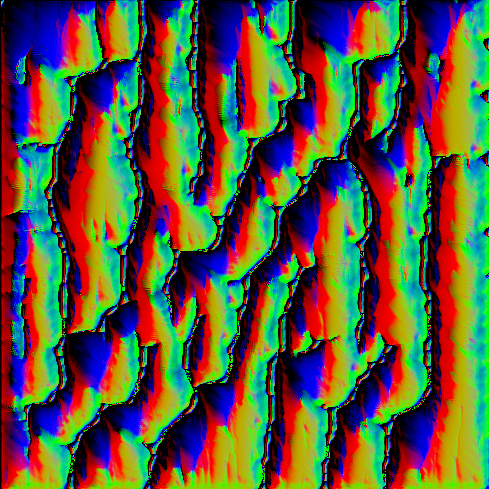
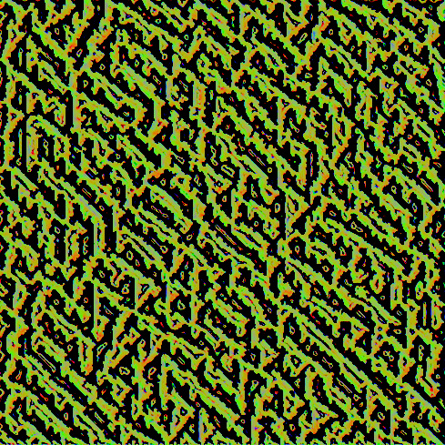
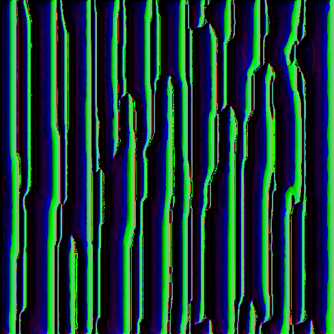
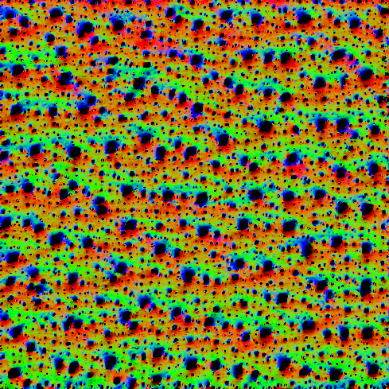
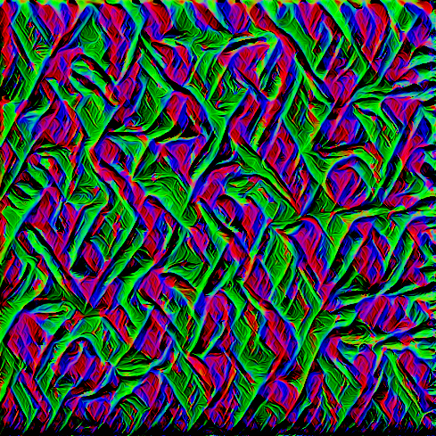
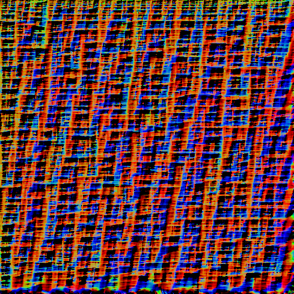
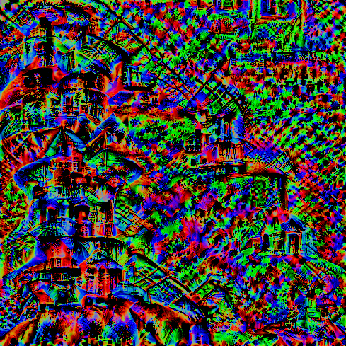
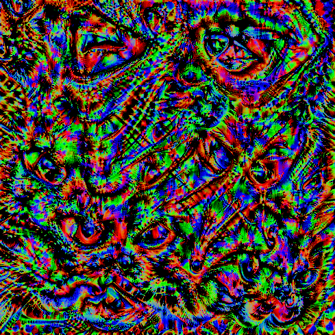
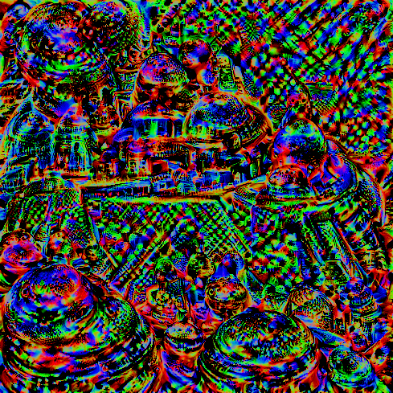

# torchart


Experimental Art Projects with PyTorch

## Installation

```
$ pip3 install -r ./requirements.txt
$ export PYTHONPATH="$PWD:$PYTHONPATH"
```

## Usage

### Filter Visualization

   


Layer: `model.features[3]`, Filter: 34(Left) 39(Center), 52(Right)

  

Layer: `model.features[10]`, Filter: 1(Left) 163(Center) 237(Right)

  

Layer: `model.features[29]`, Filter: 33(Left) 132(Center), 390(Right)

```
$ python3 torchart/filtervisualization/main.py
```

### Run unit test

```
$ pytest ./torchart
```

### Check code format

```
$ flake8 ./torchart
```
